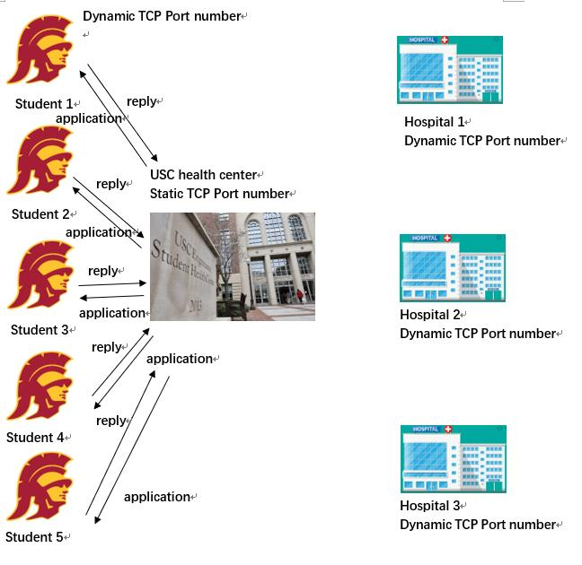
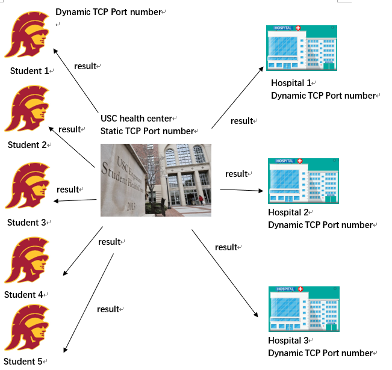

# EE450 Final Project
-- USC Healthcenter Covid-19 testing application


## Project Description 

This project is to simulate a covid-19 tesing application process. This process involves the USC students who apply for covid-19 virus testing, the USC Health Center that manages the testing, and the different hospitals that will provide students the chances to get the test. The communication among the USC students, health center and hospitals are performed over TCP and UDP sockets in a network with a client-server architecture.

The project has 2 major phases: 1) Hospitals provide the USC health center, the list of available departments that could do the testing process, 2) Students apply to the USC center to have the chance of getting tested. The USC health center makes the decision and sends the results to both students and hospitals. In phase 1 all communications are through TCP sockets.

<div align=center></div>
<div align=center></div>

## Compilation Steps

- g++ -o Healthcenter Healthcenter.cpp
- g++ -o Hospital Hospital.cpp
- g++ -o Student Student.cpp


## Running Steps

- Terminal 1:

    `$./Healthcenter`
    
- Terminal 2: 

    `$./Hospital`

- Wait utill on healthcenter scree, it says `End of Phase 1 for the health center`

- Terminal3:

    `$./Student`

## Expected Output

- For Hospital information received in phase I, I firstly store them in a txt file **hosp_info.txt** during TCP in each child process.
- For Student application information, I firstly store them in a txt file **student#_info**(# is the number of student) for each student so there are totally 5 files for student.
- After all TCP connection close, the Healthcenter transfer information in these txt files to array and vector.
- For UDP part, the Healthcenter check the feasibility for each student and sent reply to student. 
- Then check again and send information to hospitals.


- On-Screen

**(These results are based on the sample input in the description of project)**

**Healthcenter:**

```
The health center has TCP port 6658 and IP address 0.0.0.0 
Received the deparrtment list from <Hospital A>
Received the deparrtment list from <Hospital B>
Received the deparrtment list from <Hospital C>
End of Phase 1 for the health center
health center receive the application from <student1>
health center receive the application from <student2>
health center receive the application from <student3>
health center receive the application from <student4>
health center receive the application from <student5>
The health center has UDP port 53352 and IP address 0.0.0.0 for Phase 2 - Student1
The health center has send the application result to <Student1>
The health center has UDP port 51512 and IP address 0.0.0.0 for Phase 2 - Student2
The health center has send the application result to <Student2>
The health center has UDP port 51639 and IP address 0.0.0.0 for Phase 2 - Student3
The health center has send the application result to <Student3>
The health center has UDP port 63818 and IP address 0.0.0.0 for Phase 2 - Student4
The health center has send the application result to <Student4>
The health center  has UDP port 51041 and IP address 0.0.0.0 for Phase 2 - Student5
The health center has send the application result to <Student5>
The health center has send one admitted student to <Hospital1>
The health center has send one admitted student to <Hospital1>
The health center has send one admitted student to <Hospital1>
The health center has UDP port 51850 and IP address 0.0.0.0 for Phase 2 - Hospital1
The health center has UDP port 0 and IP address 0.0.0.0 for Phase 2 - Hospital2
The health center has send one admitted student to <Hospital3>
The health center has UDP port 64320 and IP address 0.0.0.0 for Phase 2 - Hospital3

```

**Hospital:**

```
<HospitalA> has TCP port 51464 and IP address 127.0.0.1 for Phase 1.
HospitalA is now connected to health center.
<Hospital A> has sent A1 to the health center
<Hospital A> has sent A2 to the health center
<Hospital A> has sent A3 to the health center
Updating the health center is done for <Hospital A>
End of Phase 1 for <Hospital A>
The HospitalA has UDP port 21758 and IP address 127.0.0.1 
<HospitalB> has TCP port 51465 and IP address 127.0.0.1 for Phase 1.
HospitalB is now connected to health center.
<Hospital B> has sent B1 to the health center
<Hospital B> has sent B2 to the health center
<Hospital B> has sent B3 to the health center
Updating the health center is done for <Hospital B>
End of Phase 1 for <Hospital B>
The HospitalB has UDP port 21858 and IP address 127.0.0.1 
<HospitalC> has TCP port 51466 and IP address 127.0.0.1 for Phase 1.
HospitalC is now connected to health center.
<Hospital C> has sent C1 to the health center
<Hospital C> has sent C2 to the health center
<Hospital C> has sent C3 to the health center
Updating the health center is done for <Hospital C>
End of Phase 1 for <Hospital C>
The HospitalC has UDP port 21958 and IP address 127.0.0.1 
Student1#3#A1 has been admitted to <Hospital A> 
Student2#4#A1 has been admitted to <Hospital A> 
Student4#4#A2 has been admitted to <Hospital A> 
Student3#5#C2 has been admitted to <Hospital C> 
```


**Student**

```
<Student1> has TCP port 51467 and IP address 127.0.0.1.
Student1 is now connected to health center.
<Student1> has received the reply from the health centerThe Student 1 has UDP port 22058 and IP address 0.0.0.0 
<Student2> has TCP port 51468 and IP address 127.0.0.1.
Completed sending application for <Student>
<Student2> has received the reply from the health centerThe Student 2 has UDP port 22158 and IP address 0.0.0.0 
<Student3> has TCP port 51469 and IP address 127.0.0.1.
Completed sending application for <Student3>.
<Student3> has received the reply from the health center
The Student 3 has UDP port 22258 and IP address 0.0.0.0 
<Student4> has TCP port 51470 and IP address 127.0.0.1.
Completed sending application for <Student4>.
<Student4> has received the reply from the health center
The Student 4 has UDP port 22358 and IP address 0.0.0.0 
<Student5> has TCP port 51471 and IP address 127.0.0.1.
Completed sending application for <Student5>.
<Student5> has received the reply from the health center
The Student 5 has UDP port 22458 and IP address 0.0.0.0 
<Student1> has received the application result, the result is : Accept#A1#hospitalA
<Student2> has received the application result, the result is : Accept#A1#hospitalA
<Student3> has received the application result, the result is : Accept#C2#hospitalC
<Student4> has received the application result, the result is : Accept#A2#hospitalA
<Student5> has received the application result, the result is : Reject

```


## Reference

- Some code in **Beej's** book
- Healthcenter fork() part, I refer [document](https://www.cs.dartmouth.edu/~campbell/cs50/socketprogramming.html)
- Hospital and Student part, I refer [deocument](https://www.geeksforgeeks.org/fork-execute-processes-bottom-using-wait/)

